# DebugMate — Complete System Flowchart

> Every step, every possibility, every function call — in detail.

---

## 1. SYSTEM STARTUP FLOW

```mermaid
flowchart TD
    START["🚀 python3 bot/slack_bot.py"] --> DOTENV["load_dotenv()<br/>Loads .env → os.environ"]
    DOTENV --> SYSPATH["sys.path.insert(0, parent_dir)<br/>So 'agent' module is importable"]
    SYSPATH --> IMPORT_AGENT["import agent.py<br/>├─ import core.config (load_dotenv again, safe)<br/>│  ├─ Load .env vars: AI_GATEWAY_*, AWS_*, LOGSTORE_*, EDITION_*<br/>│  ├─ load_service_config('district_membership_service')<br/>│  │  └─ Read configs/district_membership_service.json<br/>│  └─ Build: AI_GATEWAY_CONFIG, AWS_CONFIG, DEFAULT_HEADERS, EDITION_HEADERS<br/>├─ import core.ai_gateway_llm (AIGatewayLLM, AIGatewayEmbeddings)<br/>├─ import core.prompt → build_system_prompt()<br/>│  └─ Reads SERVICE_CONFIGS → builds dynamic prompt with:<br/>│     RPC methods, debugging scenarios, DB schema, troubleshooting<br/>├─ import tools/__init__.py<br/>│  ├─ import tools.logstore (search_logstore, search_panic_logs, etc.)<br/>│  ├─ import tools.codebase (search_codebase)<br/>│  ├─ import tools.admin_api (search_admin_apis)<br/>│  └─ import tools.aws (search_aws_cli + boto3.Session init)"]
    
    IMPORT_AGENT --> CREATE_LLM["llm = AIGatewayLLM(**AI_GATEWAY_CONFIG)<br/>Model: gpt-5, Temp: 0, Timeout: 180s"]
    CREATE_LLM --> CREATE_PROMPT["prompt = ChatPromptTemplate([system, messages])<br/>System prompt ~320 lines with service context"]
    CREATE_PROMPT --> CREATE_MEMORY["memory = MemorySaver()<br/>In-memory conversation history per thread_id"]
    CREATE_MEMORY --> CREATE_AGENT["agent = create_react_agent(<br/>  llm, tools=[6 tools], checkpointer=memory, prompt)"]
    CREATE_AGENT --> BUILD_GRAPH["workflow = StateGraph(AgentState)<br/>START → agent → END"]
    
    BUILD_GRAPH --> IMPORT_CLEANUP["from tools import cleanup_all_collections"]
    IMPORT_CLEANUP --> VALIDATE_TOKENS{"Check SLACK_BOT_TOKEN<br/>& SLACK_APP_TOKEN"}
    VALIDATE_TOKENS -->|Missing| RAISE_ERROR["❌ raise ValueError"]
    VALIDATE_TOKENS -->|Present| INIT_APP["app = App(token=SLACK_BOT_TOKEN)"]
    INIT_APP --> START_SCHEDULER["start_midnight_scheduler()<br/>├─ Calculate seconds until 00:00<br/>├─ threading.Timer(delay, _midnight_cleanup_loop)<br/>└─ timer.daemon = True, timer.start()"]
    START_SCHEDULER --> SOCKET_MODE["handler = SocketModeHandler(app, SLACK_APP_TOKEN)<br/>handler.start()<br/>🟢 Bot is LIVE — listening for events"]

    style START fill:#4CAF50,color:white
    style SOCKET_MODE fill:#2196F3,color:white
    style RAISE_ERROR fill:#f44336,color:white
```

---

## 2. SLACK EVENT HANDLING — Three Entry Points

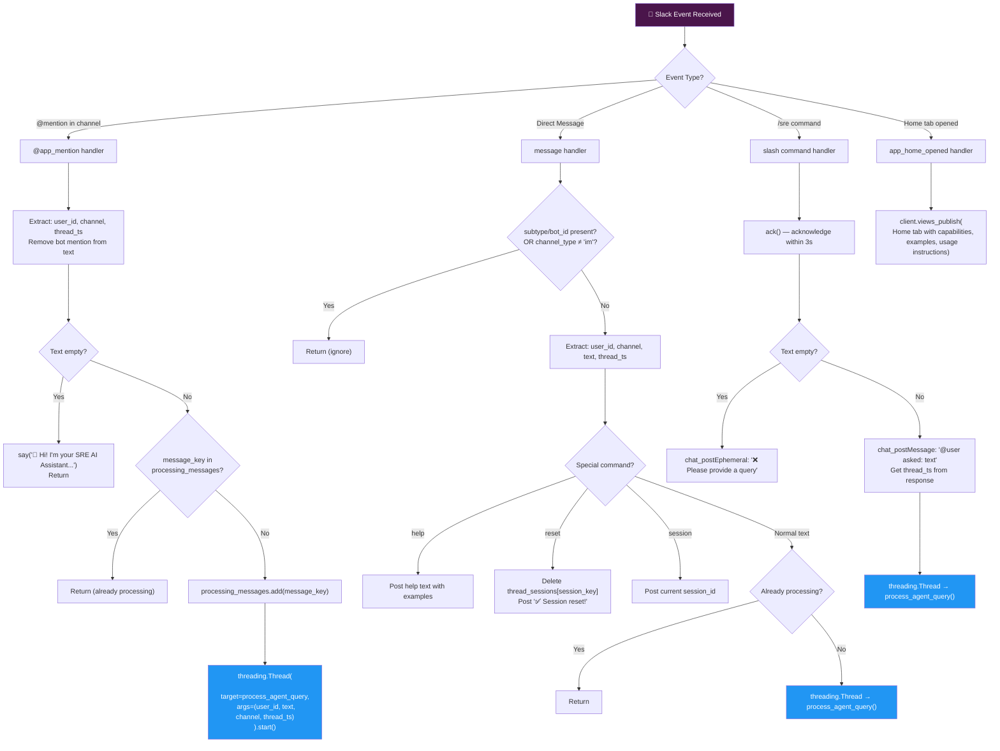

---

## 3. AGENT QUERY PROCESSING — The Core Loop

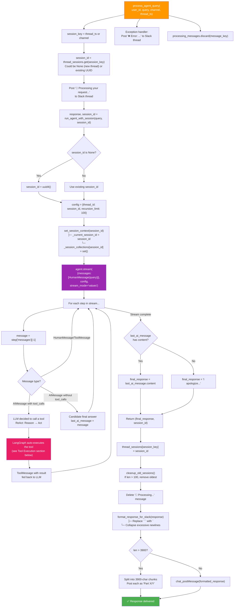

---

## 4. AI GATEWAY LLM — How Each LLM Call Works

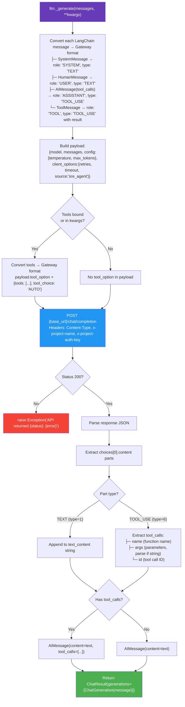

---

## 5. TOOL: search_logstore — Full RAG Pipeline

```mermaid
flowchart TD
    SL["search_logstore(<br/>identifier, rpc_method,<br/>hours_ago, get_error_logs_only, environment)"] --> CALC_TIME["Calculate time window:<br/>ts_to = now - (hours_ago * 3600)<br/>ts_from = ts_to - 86400"]
    
    CALC_TIME --> PARSE_METHOD["Extract method name:<br/>'pkg/Service/Method' → 'Method'<br/>'Service.Method' → 'Method'"]
    
    PARSE_METHOD --> BUILD_FILTERS["Build filters:<br/>├─ body.l-method-name LIKE method_name<br/>├─ body.user-id LIKE identifier (if present)<br/>└─ msg LIKE [error, exception, failed] (if errors_only)"]
    
    BUILD_FILTERS --> API_POST["POST LOGSTORE_URL<br/>Headers: DEFAULT_HEADERS (auth + cookie from .env)<br/>Payload: {ts_from, ts_to, logtype, filters, environment}<br/>Timeout: 120s"]
    
    API_POST --> CONTENT_TYPE{Response Content-Type?}
    CONTENT_TYPE -->|"text/html"| AUTH_ERR["Return: AUTH_REQUIRED<br/>'API returned HTML login page'"]
    CONTENT_TYPE -->|"application/json"| PARSE_JSON["Parse response JSON"]
    
    PARSE_JSON --> VALID_DICT{Is dict?}
    VALID_DICT -->|No| INVALID["Return: INVALID_RESPONSE"]
    VALID_DICT -->|Yes| GET_HITS["hits = data.get('hits', [])"]
    
    GET_HITS --> EXTRACT_MSGS["Extract messages:<br/>for hit in hits:<br/>  if 'msg' in hit: messages.append(hit['msg'])"]
    
    EXTRACT_MSGS --> HAS_MSGS{len(messages) > 0?}
    HAS_MSGS -->|No| NO_LOGS["Return: {total_hits: 0, processed_logs: []}"]
    HAS_MSGS -->|Yes| COLLECTION["collection_name = _build_collection_name(<br/>  f'logs_{method_name}', environment)<br/>e.g. 's_abc123def456_logs_GetMembership_prod'"]
    
    COLLECTION --> STORE["store_logs_in_vector_db(messages, collection_name)"]
    
    STORE --> STORE_INIT["initialize_vector_db() — lazy init"]
    STORE_INIT --> STORE_INIT_CHECK{Already initialized?}
    STORE_INIT_CHECK -->|Yes| STORE_GET_COLLECTION
    STORE_INIT_CHECK -->|No| TRY_EMBEDDINGS["Try embedding models in order:<br/>1. text-embedding-3-large (1536d)<br/>2. text-embedding-3-small (1536d)<br/>3. text-embedding-ada-002 (1536d)<br/>Each: create AIGatewayEmbeddings → embed_query('test')"]
    TRY_EMBEDDINGS --> EMB_SUCCESS{Any model worked?}
    EMB_SUCCESS -->|No| VDB_DISABLED["vector_db_enabled = False"]
    EMB_SUCCESS -->|Yes| VDB_ENABLED["vector_db_enabled = True<br/>Initialize LLM for prompt refinement"]
    VDB_DISABLED --> STORE_FAIL
    VDB_ENABLED --> STORE_GET_COLLECTION
    
    STORE_GET_COLLECTION["get_or_create_log_collection(name)<br/>├─ Exists in _vector_stores? → reuse<br/>└─ New? → InMemoryVectorStore(embeddings)"]
    
    STORE_GET_COLLECTION --> DEDUP["Hash-based deduplication:<br/>for each log:<br/>  hash = md5(log)<br/>  if hash not in _stored_doc_hashes[name]:<br/>    new_docs.append(clean_log_message(log))<br/>    add hash to set"]
    
    DEDUP --> HAS_NEW{New docs to store?}
    HAS_NEW -->|No| DEDUP_SKIP["All duplicates — skip storage<br/>Return total count (they ARE stored)"]
    HAS_NEW -->|Yes| ADD_TEXTS["store.add_texts(new_docs)<br/>Internally: embed each doc → store in memory"]
    
    ADD_TEXTS --> STORED_COUNT["stored_count = len(messages)"]
    DEDUP_SKIP --> STORED_COUNT
    
    STORED_COUNT --> STORE_CHECK{stored_count > 0?}
    STORE_CHECK -->|No| STORE_FAIL["⚠️ Fallback: simple deduplication<br/>unique_logs = dict.fromkeys(messages)<br/>limited_logs = [clean_log_message(log) for log in unique[:10]]"]
    
    STORE_CHECK -->|Yes| REFINE["refine_search_prompt(user_query, rpc_method, identifier)<br/>├─ Build context from SERVICE_CONFIGS<br/>├─ Ask LLM to generate refined search query<br/>└─ Fallback: concatenate method + identifier + query"]
    
    REFINE --> SEMANTIC["semantic_search_logs(refined_query, collection_name, n=10)<br/>├─ store.similarity_search(query, k=10)<br/>└─ Return [doc.page_content for doc in results]"]
    
    SEMANTIC --> LIMITED["limited_logs = relevant_logs[:10]"]
    STORE_FAIL --> LIMITED
    
    LIMITED --> RESULT_JSON["Return JSON:<br/>{total_hits, original_count, stored_in_vector_db,<br/>relevant_logs_count, search_method, processed_logs}"]

    style SL fill:#E91E63,color:white
    style API_POST fill:#2196F3,color:white
    style ADD_TEXTS fill:#9C27B0,color:white
    style SEMANTIC fill:#FF9800,color:white
    style AUTH_ERR fill:#f44336,color:white
```

---

## 6. TOOL: get_all_logs_for_request_id

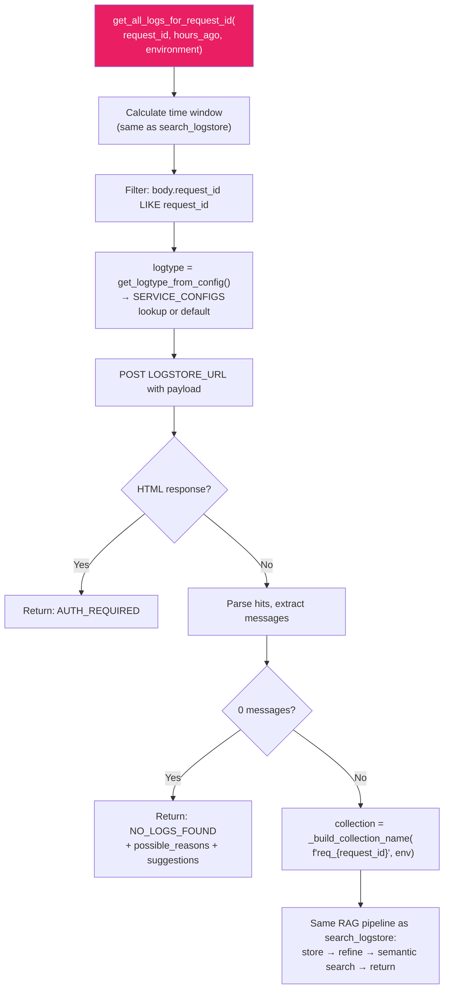

---

## 7. TOOL: search_panic_logs

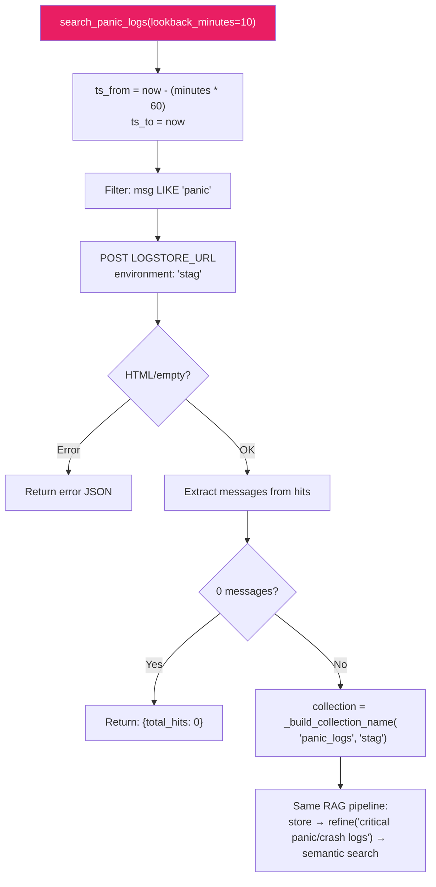

---

## 8. TOOL: retrieve_stored_logs (Cross-Session Search)

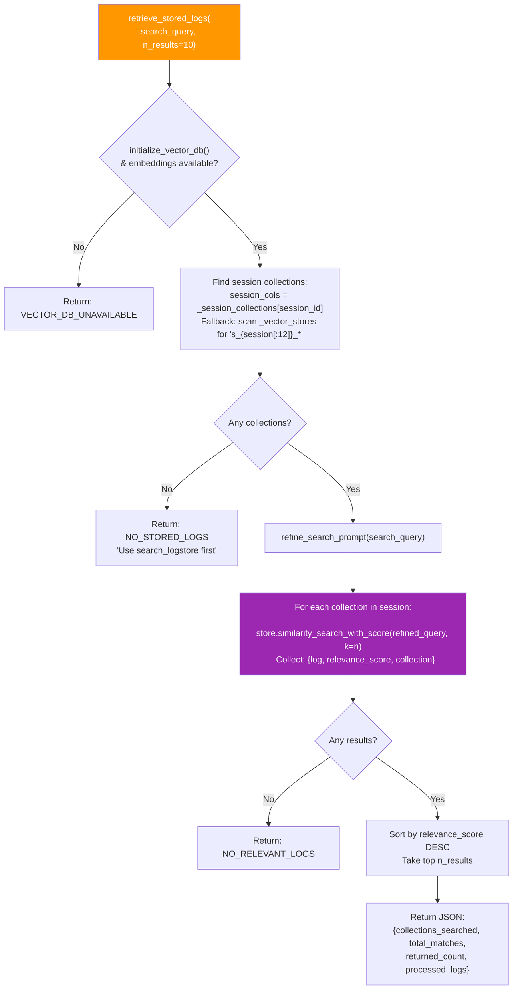

---

## 9. TOOL: search_admin_apis

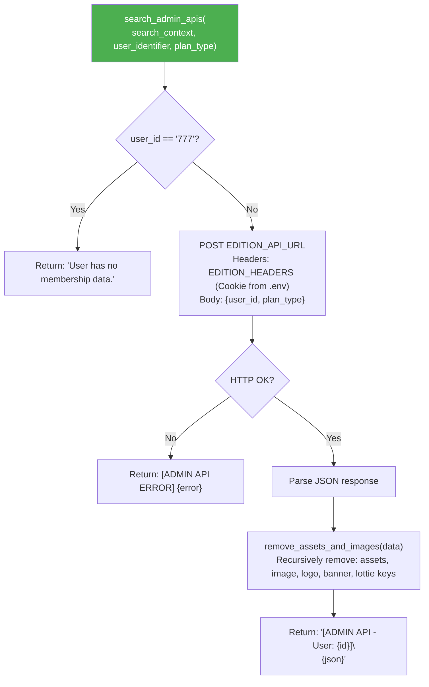

---

## 10. TOOL: search_aws_cli

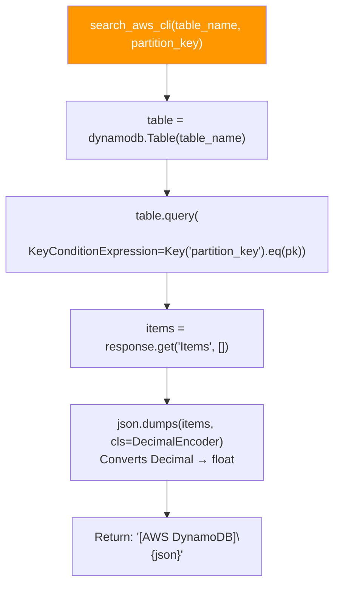

---

## 11. TOOL: search_codebase (Currently Disabled)

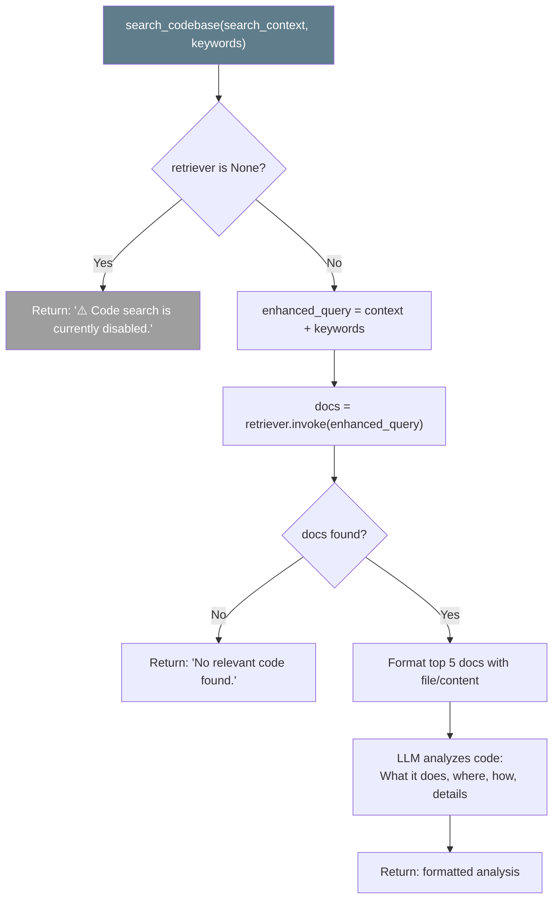

---

## 12. LOG CLEANING PIPELINE (clean_log_message)

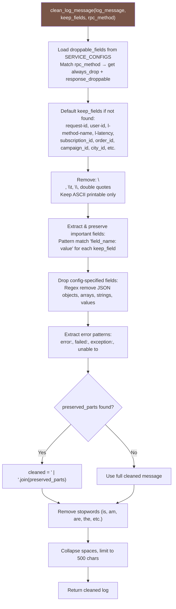

---

## 13. SESSION & MEMORY ARCHITECTURE

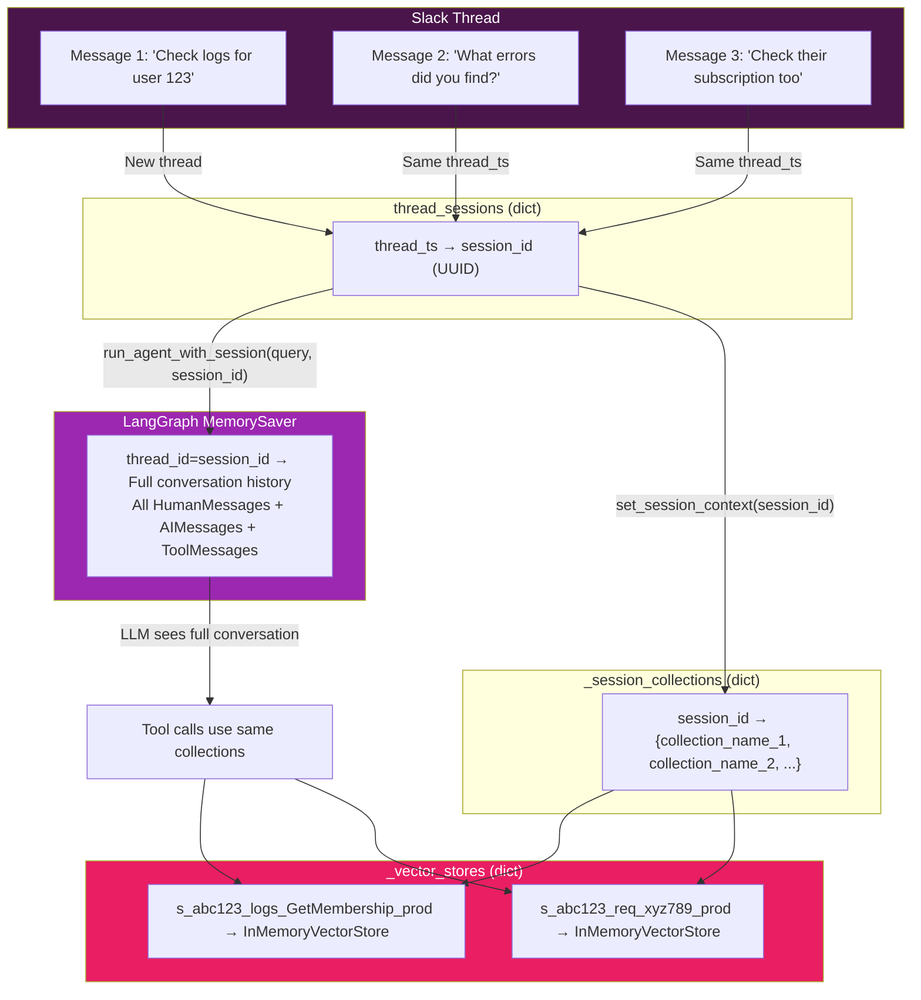

---

## 14. MIDNIGHT CLEANUP FLOW

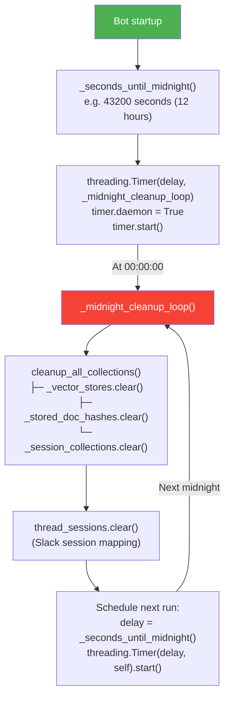

---

## 15. AI GATEWAY EMBEDDINGS FLOW

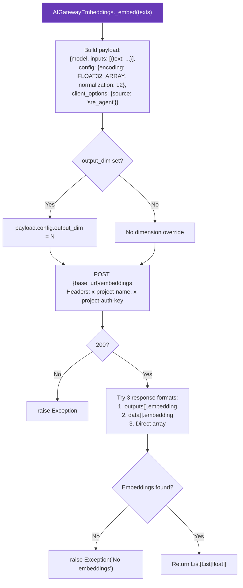

---

## 16. COMPLETE END-TO-END EXAMPLE

```
User in Slack: "@DebugMate check logs for user 162434451 GetApplicableCampaigns"

1. SLACK EVENT
   └─ @app_mention → extract text, thread_ts
   └─ threading.Thread → process_agent_query()

2. SESSION
   └─ session_key = thread_ts = "1234567890.123456"
   └─ session_id = None (new thread) → uuid4() = "a1b2c3d4-..."
   └─ set_session_context("a1b2c3d4-...")

3. AGENT (ReAct Loop)
   └─ LLM receives: system_prompt + HumanMessage("check logs for user...")
   └─ LLM decides: Call search_logstore(
        identifier="162434451",
        rpc_method="GetApplicableCampaigns",
        hours_ago=0,
        environment="prod"
      )

4. TOOL: search_logstore
   ├─ Time window: [now-24h, now]
   ├─ Filters: l-method-name LIKE "GetApplicableCampaigns", user-id LIKE "162434451"
   ├─ POST https://kyno.z.tt/logstore/api/v1/query → 47 hits
   ├─ Extract 47 messages from hits
   ├─ Collection: "s_a1b2c3d4e5f6_logs_GetApplicableCa_prod"
   ├─ store_logs_in_vector_db():
   │   ├─ initialize_vector_db() → try text-embedding-3-large ✅
   │   ├─ InMemoryVectorStore(embeddings) created
   │   ├─ Hash dedup: 47 unique → 47 new docs
   │   ├─ store.add_texts(47 cleaned logs) → embedded + stored
   │   └─ stored_count = 47
   ├─ refine_search_prompt():
   │   ├─ Load SERVICE_CONFIGS context for GetApplicableCampaigns
   │   ├─ LLM generates refined query: "GetApplicableCampaigns user 162434451 campaign eligibility..."
   │   └─ Return refined query
   ├─ semantic_search_logs():
   │   ├─ store.similarity_search(refined_query, k=10)
   │   └─ Return 10 most relevant log messages
   └─ Return JSON: {total_hits: 47, relevant_logs_count: 10, processed_logs: [...]}

5. AGENT (ReAct continued)
   └─ LLM receives ToolMessage with 10 relevant logs
   └─ LLM analyzes logs, formats response:
      "User 162434451's GetApplicableCampaigns call shows:
       - Request received at 14:32 UTC
       - 3 campaigns evaluated, 2 eligible
       - Campaign C-1234 filtered out due to city_id mismatch
       ..."

6. SLACK RESPONSE
   └─ Delete "🤖 Processing..." message
   └─ format_response_for_slack(response)
   └─ Post formatted response to thread
   └─ thread_sessions["1234567890.123456"] = "a1b2c3d4-..."

7. FOLLOW-UP MESSAGE (same thread)
   User: "What errors did you find?"
   └─ Same thread_ts → same session_id
   └─ LLM sees full conversation history (MemorySaver)
   └─ LLM decides: Call retrieve_stored_logs(
        search_query="errors failures exceptions",
        n_results=10
      )
   └─ Searches EXISTING embeddings (no new API call!)
   └─ Returns error-focused logs from session collections
```

---

## 17. FILE DEPENDENCY MAP

```
.env                          ← All secrets, URLs, tokens, cookies
.env.example                  ← Safe template for commits
│
bot/slack_bot.py              ← Entry point: load_dotenv() → import agent
│   ├── agent.py              ← ReAct agent: LLM + tools + memory
│   │   ├── core/config.py    ← load_dotenv(), AI_GATEWAY_CONFIG, AWS_CONFIG, headers
│   │   ├── core/prompt.py    ← build_system_prompt() from SERVICE_CONFIGS
│   │   ├── core/ai_gateway_llm.py ← AIGatewayLLM (BaseChatModel), AIGatewayEmbeddings
│   │   ├── core/models.py    ← Pydantic schemas: LogstoreInput, AdminAPIInput, etc.
│   │   └── tools/__init__.py ← Re-exports all tools
│   │       ├── tools/logstore/logstore_tool.py  ← RAG pipeline: fetch → store → embed → search
│   │       │   └── tools/logstore/utils.py      ← clean_log_message() with config-based field dropping
│   │       ├── tools/codebase/codebase_tool.py  ← Code search (currently disabled, retriever=None)
│   │       ├── tools/admin_api/admin_api_tool.py← POST Edition API for user subscriptions
│   │       └── tools/aws/aws_tool.py            ← DynamoDB queries via boto3
│   └── tools.cleanup_all_collections            ← Midnight purge of all vector stores
│
configs/district_membership_service.json          ← Service-specific config: RPC methods, debug scenarios
legacy/sre_agent.py                               ← Old monolithic version (not used by bot)
docs/FLOWCHART.md                                 ← This file
docs/FLOW_SUMMARY.md                              ← Layman-friendly flow explanation
README.md                                         ← Project documentation
```

---

## 18. DATA FLOW SUMMARY TABLE

| Step | Component | Input | Output | External Call? |
|------|-----------|-------|--------|----------------|
| 1 | Slack Bot | Slack event (mention/DM/command) | Parsed text + thread_ts | No |
| 2 | Session Manager | thread_ts | session_id (UUID) | No |
| 3 | Agent (LangGraph) | HumanMessage + history | Tool calls or final answer | AI Gateway LLM |
| 4a | search_logstore | identifier, method, env | 10 relevant logs (JSON) | Logstore API + AI Gateway (embed + LLM) |
| 4b | get_all_logs_for_request_id | request_id, env | 10 relevant logs (JSON) | Logstore API + AI Gateway |
| 4c | search_panic_logs | lookback_minutes | Panic logs (JSON) | Logstore API + AI Gateway |
| 4d | retrieve_stored_logs | search_query | Logs from existing embeddings | AI Gateway (embed only) |
| 4e | search_admin_apis | user_id, plan_type | User subscription data (JSON) | Edition API |
| 4f | search_aws_cli | table, partition_key | DynamoDB items (JSON) | AWS DynamoDB |
| 4g | search_codebase | context, keywords | Code analysis (disabled) | None (disabled) |
| 5 | Agent (LangGraph) | Tool results | Analyzed response text | AI Gateway LLM |
| 6 | Slack Bot | Response text | Formatted Slack message | Slack API |
| 7 | Midnight Scheduler | Timer event | Cleared memory | No |
